# Orange Scout

## Visão Geral

**Orange Scout** é um aplicativo mobile desenvolvido para registrar estatísticas de jogadores de basquete de forma fácil e rápida.

### Problema Resolvido

**Orange Scout** tem como objetivo capacitar o usuário a registrar as estatísticas de jogadores durante uma partida de basquete, permitindo a visualização detalhada desses dados após o jogo. Isso possibilita que treinadores monitorem o desempenho dos jogadores, destacando seus pontos fortes e fracos, para que possam tomar medidas assertivas em relação ao desenvolvimento do atleta.

### Público-Alvo

Jogadores de basquete, treinadores de basquete, espectadores de basquete e organizadores de campeonatos.

### Características Principais

* Autenticação de usuário
* Gerenciamento de times e jogadores
* Monitoramento de estatísticas em tempo real
* Histórico de partidas
* Visualização de estatísticas detalhadas

## Fluxo do Usuário e Diagramas

### Autenticação

Ao abrir o aplicativo, o sistema verifica se o usuário possui um token válido (indicando um login recente). Se o usuário não tiver um token válido, ele será direcionado para a tela de login:

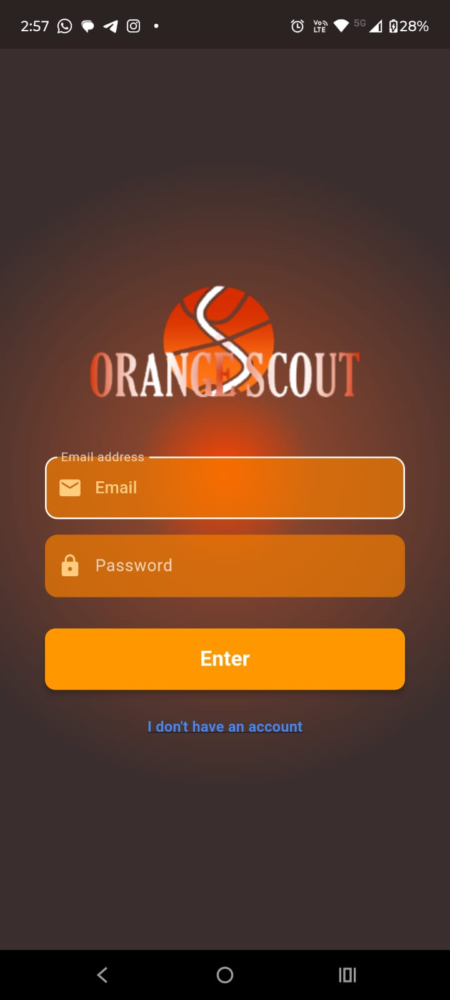

Na tela de login, há um formulário para inserir credenciais, um botão para efetuar o login e outro para usuários que ainda não possuem uma conta. Caso o usuário já tenha uma conta, pode preencher os campos e pressionar "Login", sendo então direcionado para a tela inicial.

Se o usuário clicar em "I don't have an account" (Não tenho uma conta), ele será redirecionado para a tela de cadastro:

Aqui, o usuário pode retornar à tela de login clicando em "I Already have an account" (Já tenho uma conta). Se o usuário preencher o formulário corretamente e pressionar "Register" (Registrar), um e-mail com um código de validação será enviado para o endereço fornecido, e o usuário será direcionado para a tela de validação:

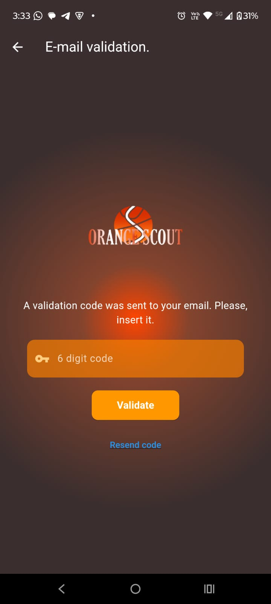

Nessa tela, o usuário tem três opções:

* Clicar em "Voltar" e validar depois (a validação será solicitada ao tentar iniciar uma partida).
* Inserir o código recebido por e-mail no campo e clicar no botão "Validate" (Validar).
* Clicar em "Resend Code" (Reenviar Código), o que enviará um novo código para o e-mail registrado.

Quando "Resend Code" é pressionado, um snackbar aparecerá indicando que um novo código foi enviado:

*Na imagem, a barra verde cobre meu e-mail por questões de segurança. No aplicativo, o e-mail é exibido corretamente.*

Caso o código correto seja inserido e o botão "Validate" for pressionado, o usuário será levado à tela inicial do aplicativo e sua conta estará validada.

### Começando uma Partida

Ao ser redirecionado para a tela inicial, o usuário estará na tela de seleção de jogo, onde terá três modos de jogo para escolher:

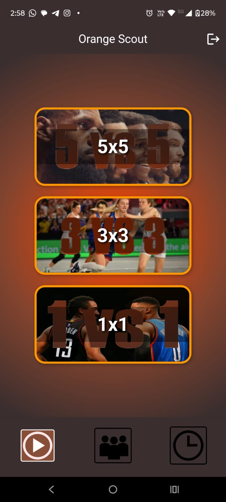

Se o usuário não validou seu e-mail, ele não poderá selecionar nenhum modo de jogo. Uma snackbar aparecerá indicando isso, e o usuário poderá navegar para a tela de validação a partir dali:

Se o usuário validou seu e-mail, mas ainda não tem pelo menos dois times, uma snackbar também será exibida para informá-lo:

Se o usuário tiver pelo menos dois times e o e-mail estiver validado, ele será redirecionado para a tela de seleção de times e jogadores iniciais para cada time. Os jogadores são exibidos na ordem em que foram criados:

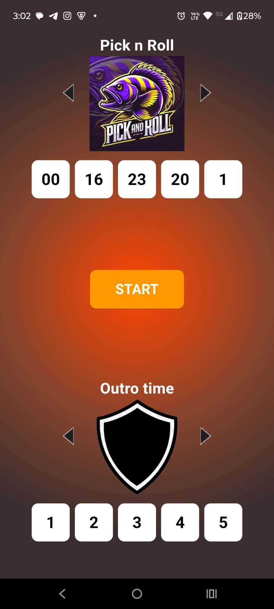

Caso não existam jogadores suficientes em algum dos times para o modo de jogo selecionado, o botão "Start Match" (Começar Partida) será desativado:

Se houver jogadores suficientes em ambos os times, o botão "START" é habilitado. Ao pressioná-lo, o usuário é redirecionado para a tela de registro de estatísticas, onde poderá registrar as ações dos jogadores:

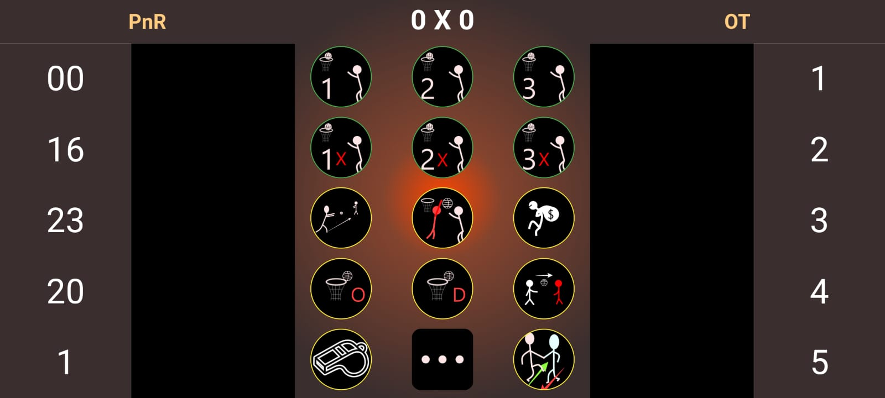

Após algumas ações serem registradas, a tela ficará assim:

Nessa tela, além dos botões de ações gerais (pontos, erros, faltas, etc.), há um botão de opções. Ao ser pressionado, ele expande um menu com três opções:

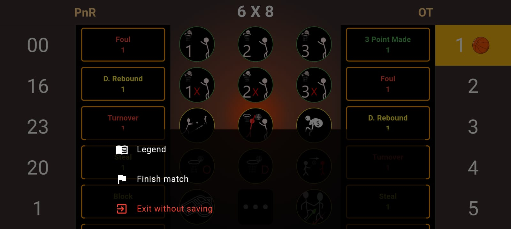

O menu contém as seguintes opções:

* **Legend** — Exibe uma imagem explicando o significado de cada botão.
* **Exit Without Saving** — Solicita ao usuário que confirme a saída do jogo sem salvar o progresso.
* **Finish Match** — Salva a partida e suas estatísticas no banco de dados.

Se o usuário selecionar "Legend", uma imagem com as legendas aparecerá:

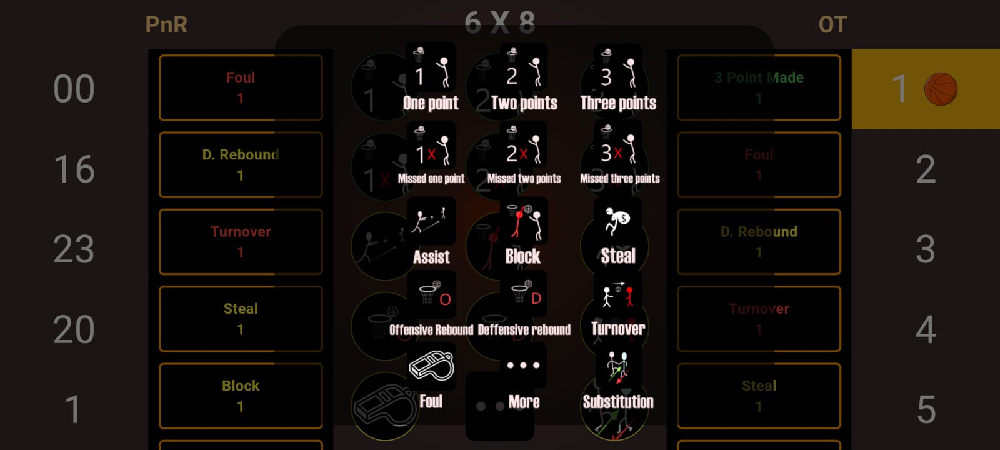

Se o usuário selecionar "Exit Without Saving", um prompt de confirmação será exibido:

Se o usuário selecionar "Finish Match", as estatísticas são salvas e enviadas para o backend, que as armazena no banco de dados:

É possível que, no meio da partida, o usuário minimize o aplicativo para usar outros, e o sistema operacional, nesse meio tempo, termine a aplicação, fazendo com que o usuário perca o progresso. Para evitar isso, uma funcionalidade foi implementada que salva automaticamente a partida sempre que o aplicativo é minimizado. Assim, quando o usuário retorna ao aplicativo, o sistema verifica o banco de dados em busca de partidas não finalizadas. Se uma for encontrada, o usuário pode optar por continuar a partida sem perder o progresso:

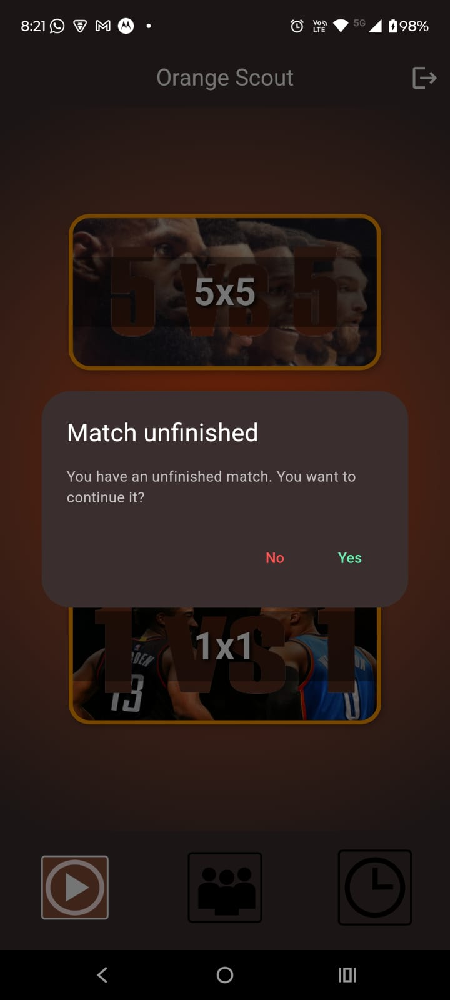

Se o usuário selecionar "Não" (no diálogo de partida inacabada), a partida é finalizada e salva no banco de dados — ela não é descartada. Se o usuário escolher "Sim", ele é redirecionado de volta à tela de registro de estatísticas e pode continuar a partida.

### Criando e Editando Times e Jogadores

Na barra de navegação do aplicativo, o botão do meio leva o usuário para a tela de times. Lá, ele poderá visualizar, criar e editar seus times. Outra forma de acessar essa tela é quando o usuário tenta selecionar um modo de jogo, mas tem menos de dois times; nesse caso, clicar na snackbar os redirecionará para a tela de times:

Assim, chegamos à tela de times:

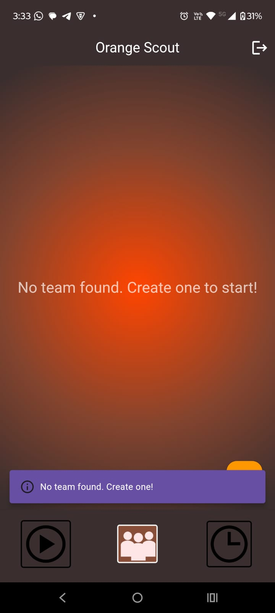

Como a tela está vazia, uma snackbar aparece solicitando ao usuário que crie um novo time. Ao clicar no botão "+" localizado no canto inferior direito da tela, o usuário é direcionado para a tela de criação de time:

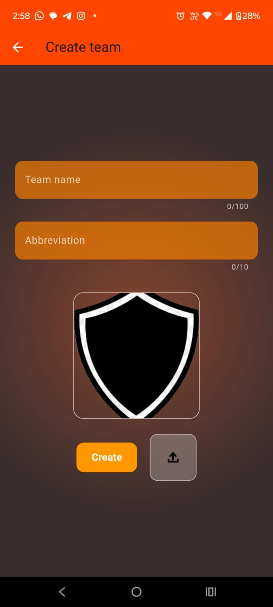

Nessa tela, há dois campos para preencher, um botão para finalizar a criação do time e um botão que abre a galeria do dispositivo para selecionar um escudo personalizado para o time. O aplicativo solicitará permissão ao usuário antes de acessar o armazenamento.

Após clicar no botão "Create" (Criar), o usuário é redirecionado de volta à tela de times, que agora exibe o time recém-criado:

Nessa tela, podemos clicar em um time para editá-lo, o que exibe opções para editar o time, excluí-lo e gerenciar jogadores:

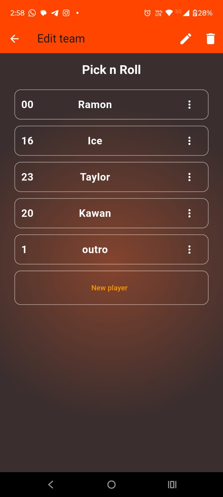

Na tela de edição de time, as seguintes opções estão disponíveis:

* **Editar Time**: Representado pelo ícone de lápis no canto superior direito.
* **Excluir Time**: Representado pelo ícone de lixeira ao lado do lápis (inclui todos os jogadores associados).

Se o usuário selecionar o ícone da lixeira, um prompt de confirmação aparecerá para evitar exclusões acidentais:

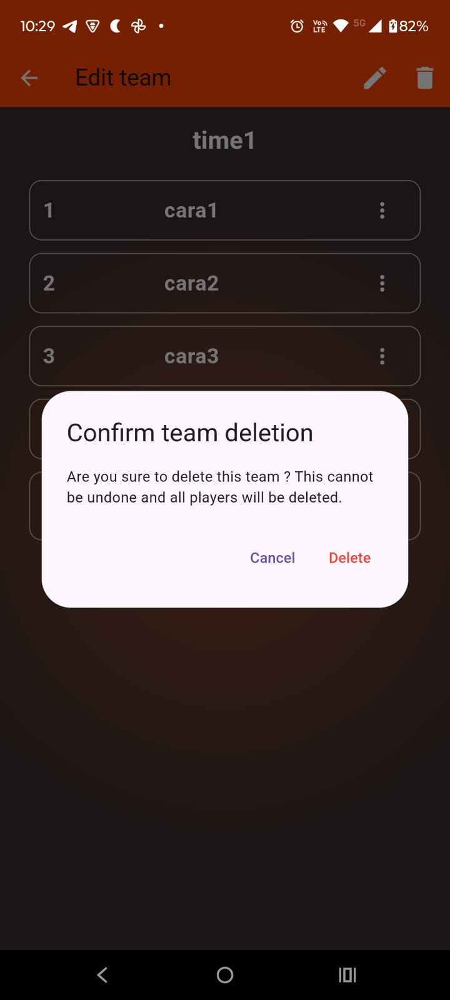

Ao confirmar "Delete" (Excluir), o usuário será redirecionado de volta à tela de times, que não mais conterá o time excluído.

Ainda na tela de edição de time, clicar no ícone de lápis redirecionará o usuário para a tela de edição de time, onde é possível atualizar o nome, a abreviação e o escudo do time:

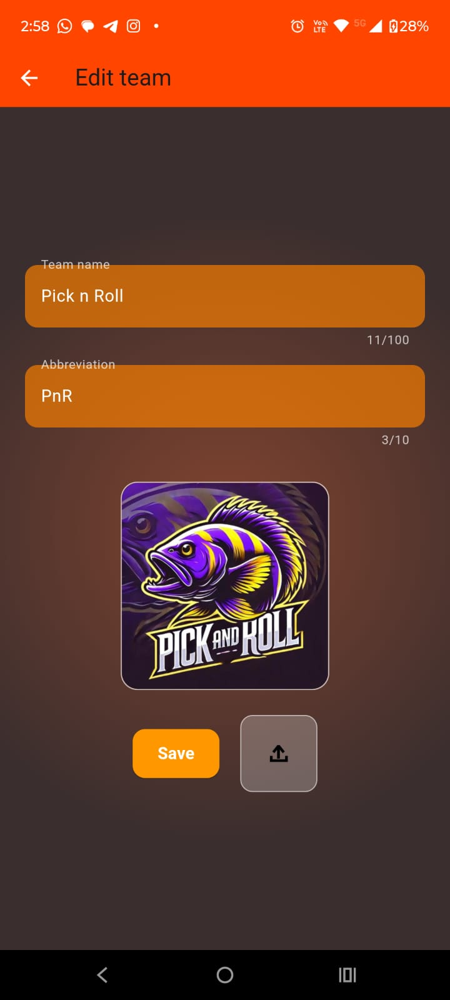

Esta tela é a mesma da tela de criação de time, mas, em vez de criar um novo, ela atualiza o time selecionado.

Adicionalmente, na tela de edição de time, o usuário pode visualizar a lista de jogadores daquele time. Há sempre um widget dedicado para adicionar um novo jogador.

Ao lado de cada jogador, há um botão de menu que, quando pressionado, abre um menu com as opções para editar ou excluir o jogador:

Quando o menu está aberto, o usuário vê as opções: "Edit player" (Editar jogador) e "Delete player" (Excluir jogador).

Selecionar "Edit player" abre um diálogo com dois campos de entrada para editar o jogador e dois botões: "Save" (Salvar) e "Cancel" (Cancelar).

Clicar em "Save" atualiza o jogador com os novos valores:

Selecionar "Delete player" abre um diálogo de confirmação para evitar exclusões acidentais:

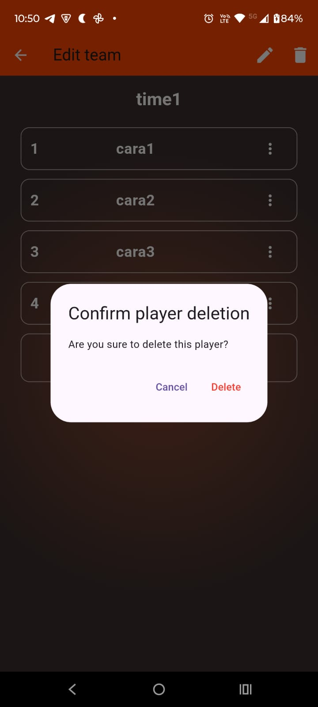

Se o usuário pressionar "Delete", ele é retornado à tela de edição de time, agora sem o jogador removido. Pressionar "Cancel" simplesmente fecha o diálogo de confirmação sem deletar nada.

### Abrindo as Estatísticas

Na barra de navegação, o ícone mais à direita direciona o usuário para a tela de histórico de partidas (Statistics/History screen):

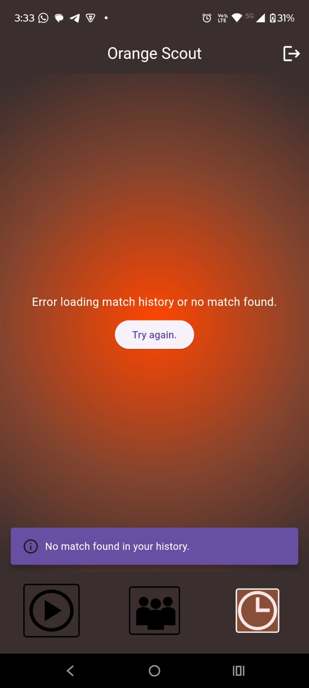

Se não houver nenhuma partida finalizada, esta será a tela exibida. No entanto, se houver partidas finalizadas, a tela mostrará resumos das estatísticas em uma lista de widgets.

Cada widget de partida contém:

* Um botão no canto esquerdo para abrir as estatísticas detalhadas daquela partida específica.
* O escudo e a abreviação de cada time.
* O placar e a data da partida.
* Um botão de localização para visualizar onde a partida foi jogada.
* Um botão para excluir a partida do histórico.

Ao clicar no botão vermelho de exclusão, um diálogo de confirmação aparece para evitar exclusões acidentais:

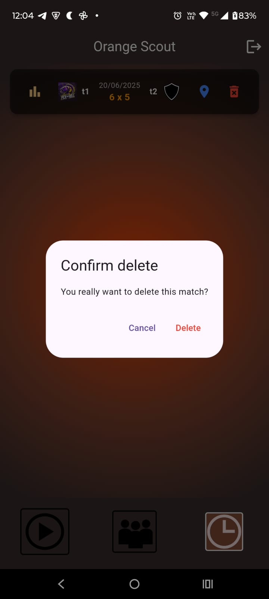

Se o usuário confirmar "Delete" (Excluir), ele será retornado à tela de histórico, agora sem a partida excluída.

Clicar no botão de estatísticas (ícone no canto esquerdo do widget de partida) abre a tela de Estatísticas para aquela partida específica:

Nessa tela de Estatísticas, há também um botão no lado direito da tela caso o usuário queira excluir a partida diretamente dali:

Adicionalmente, esta tela inclui um botão de filtro que permite ao usuário filtrar as estatísticas por time, prevenindo que a tela fique muito poluída:

Voltando à tela de histórico, há também um ícone de localização. Este botão abre o aplicativo Google Maps com as coordenadas de onde a partida foi jogada.

A localização não é 100% precisa porque o aplicativo não utiliza as APIs pagas do Google para serviços de localização precisa (por razões financeiras). Em vez disso, quando uma partida é finalizada, o aplicativo solicita permissão ao usuário para acessar sua localização, recupera as coordenadas GPS atuais e as salva.

Quando o botão de localização é clicado, o Google Maps é aberto com essas coordenadas passadas como argumentos, mostrando um ponto aleatório próximo ao local onde a partida realmente ocorreu.

## Desafios e Soluções

Existiram muitos problemas que tive que lidar e resolver durante o desenvolvimento, alguns deles são:

* **Problemas de Conexão com o Banco de Dados**: Encontrei `NullPointerException`s com `SqlExceptionHelper` e `UnknownHostException`. A depuração foi sistemática, verificando `psql`, o prefixo `jdbc:`, variáveis de ambiente, a simplificação da senha e o uso de `sslmode=require`. Passei muito tempo procurando soluções para isso, simplesmente por causa do endereço errado do banco de dados. Os serviços de deploy que utilizei (como Render e outros) forneciam diferentes tipos de endereços para comunicação com o banco de dados em nuvem, mas nenhum deles funcionava diretamente. Eventualmente, percebi que esses serviços não incluíam o prefixo "jdbc:" na URL e que o Spring só reconhece endereços que o possuem. Além disso, a URL fornecida não estava no padrão correto de host e porta esperados pelo driver Java. Tive que ler os endereços fornecidos pelos sites e combiná-los com o padrão esperado para que a conexão funcionasse, pois, no fim das contas, o site me dava o nome de host errado, mas o endereço completo tinha o nome certo de host.

* **Obstáculos no Deploy**: Antes de fazer o deploy, pesquisei sobre as opções gratuitas, já que não tinha fundos (e nunca tinha feito um deploy antes, então achava que haveria muitas opções boas e gratuitas). No entanto, ao explorar as opções gratuitas disponíveis, acabei optando por não disponibilizar o aplicativo ao público, pois as opções de deploy gratuito não ofereciam o necessário para uma experiência minimamente aceitável. No entanto, fiz o deploy na opção gratuita para testar e escolhi o Render para isso, após ver um vídeo que demonstrava a simplicidade de fazer tudo lá — tanto o banco de dados quanto o deploy da API, e até mesmo como criar o Dockerfile para o deploy.

* **Alinhamento Frontend/Backend (Flutter/Spring Boot)**: Durante a fase de testes, precisei lidar com muitos problemas de diferença de tipos (`types`) entre os DTOs enviados pelo backend e os recebidos pelo frontend, e vice-versa. Antes de finalizar o desenvolvimento, tive que refatorar todo o código (com ajuda de inteligência artificial para produtividade), o que resultou em um código muito mais organizado. Também enfrentei dificuldades na depuração (debugging) por não ter, no início, inserido mensagens de erro descritivas, o que me forçou a perseguir os erros adicionando mensagens de `print` no código.

## Aprendizados

Este projeto não foi apenas com a intenção de aprendizado, mas também com a intenção financeira. No entanto, como mencionado, a viabilidade financeira não se concretizou. Apesar disso, acredito que este projeto foi um divisor de águas para mim e para o meu desenvolvimento acadêmico e profissional, pois nunca havia acompanhado o desenvolvimento de um aplicativo do começo ao fim.

Adquiri experiência prática em diversas áreas:

* **Resolução de Problemas**: Aprendi a resolver problemas de forma independente, não importa a sua natureza. Antes deste projeto, eu só dominava Java puro (que aprendi antes do meu curso), Flutter (durante o curso) e PostgreSQL (durante o curso). Eu não tinha conhecimento de APIs, pois não havia chegado a essa parte do curso, nem de Spring Boot e como ele facilita o desenvolvimento.
* **Boas Práticas de Código**: A documentação, que aprendi no curso, não havia sido internalizada por falta de aplicação prática, mas agora foi. O desenvolvimento do início ao fim de um projeto expandiu imensamente minha visão sobre resolução de problemas, pois agora compreendo o que cada equipe (frontend, backend, banco de dados, documentação, análise de requisitos) precisa para resolver um problema.
* **Análise de Requisitos**: Aprendi sobre a importância de uma boa análise de requisitos e como traduzir essa análise para o desenvolvimento, definindo o escopo do projeto da melhor forma para evitar a criação de funcionalidades desnecessárias durante o processo.
* **Segurança e Ambiente**: Aprendi a importância de ter padrões de dados documentados (banco de dados, API, frontend) para reduzir erros relacionados a tipos e nomes de variáveis. Compreendi a importância da documentação de API para o frontend. Aprendi a separar métodos em arquivos (algo que já fazia no backend, mas não de imediato no frontend). Entendi a importância de esconder credenciais importantes (como URLs de banco de dados, senhas, etc.) em arquivos `.env` e de não incluí-los no controle de versão (`.gitignore`). E, por fim, a importância das variáveis de ambiente (não apenas sua existência, mas como usá-las com placeholders no código), como configurá-las no site de deploy e o fato, óbvio mas que só conhecia na teoria, de que a nuvem é basicamente computadores de outras pessoas/empresas, o que exige um Dockerfile para instalar o necessário para rodar o aplicativo.

Este projeto, então, serve como um token do meu aprendizado. No futuro, pretendo revisitá-lo para aprimorá-lo e, eventualmente, colocá-lo em distribuição.

## 6. Melhorias Futuras

Durante o desenvolvimento, pesquisei e, para minha surpresa, já existiam aplicativos com o mesmo objetivo, mas muito mais avançados e há tempos no mercado – algo que não havia encontrado na minha pesquisa inicial. Para que este aplicativo se destaque em relação aos concorrentes, ele precisaria de um diferencial gigante. Já tenho uma ideia de qual seria esse diferencial, mas não possuo as habilidades necessárias para implementá-lo no momento. Pretendo adquirir essas habilidades eventualmente, mas não focarei no aplicativo por enquanto.

---
