# Orange Scout

## Overview

**Orange Scout** is a mobile application designed to record basketball player statistics quickly and easily.

### Problem Solved

**Orange Scout** aims to empower users to record player statistics during a basketball game, allowing for detailed visualization of this data after the match. This enables coaches to monitor player performance, highlighting their strengths and weaknesses, so athletes can take targeted action for their development.

### Target Audience

Basketball players, basketball coaches, basketball spectators, and tournament organizers.

### Key Features

* User authentication
* Team and player management
* Real-time stat tracking
* Match history
* Stat visualization

---

## User Flow & Diagrams

### Authentication

Upon opening the application, the system checks if the user has a valid token (indicating a recent successful login). If not, the user is redirected to the login screen:

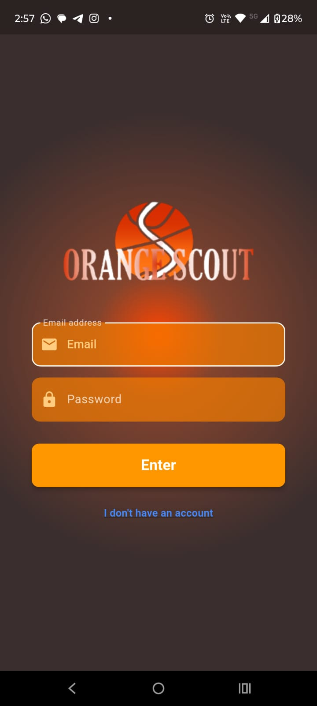

On the login screen, there's a form for credentials, a login button, and a button for users who don't have an account. If the user already has an account, they can fill in their credentials and press "Login" to be redirected to the home screen.

If the user clicks "I don't have an account," they'll be redirected to the registration screen:

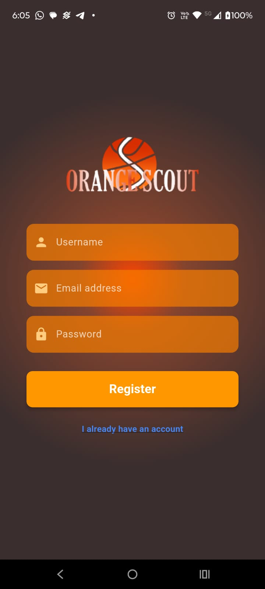

From this screen, the user can go back to the login screen by clicking "I already have an account." If the user fills out the form correctly and presses "Register," a validation email will be sent to the provided address, and the user will be redirected to the validation screen:

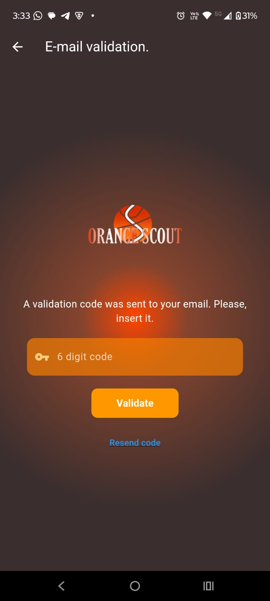

On this screen, the user has three options:

* Click "Back" to validate later (validation will be requested when attempting to start a match).
* Enter the code received via email into the input field and press "Validate."
* Click "Resend Code," which will send a new code to the registered email.

When "Resend Code" is pressed, a snackbar will appear, indicating that a new code has been sent:

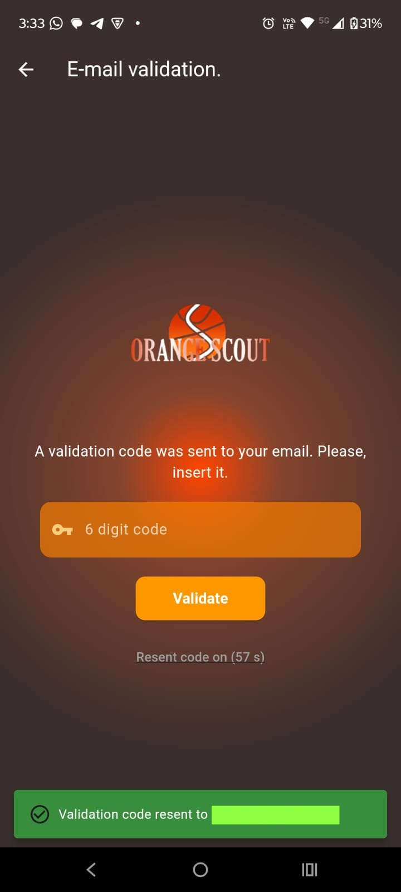

*In the image, the green bar covers my email for security reasons. In the actual app, the email is displayed correctly.*

If the correct code is entered and the "Validate" button is pressed, the user will be taken to the app's home screen, and their account will be successfully validated.

### Starting a Match

Upon being redirected to the home screen, the user will find themselves on the game selection screen, where they can choose from three game modes:

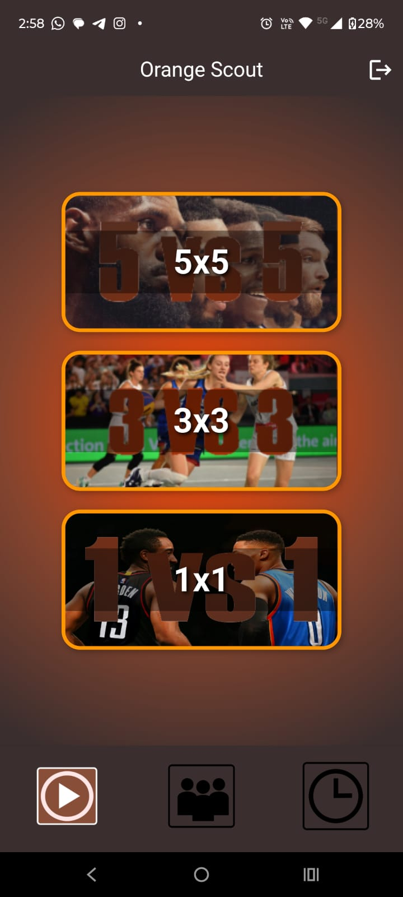

If the user hasn't validated their email, they won't be able to select any game mode. A snackbar will appear to inform them, and they can navigate to the validation screen from there:

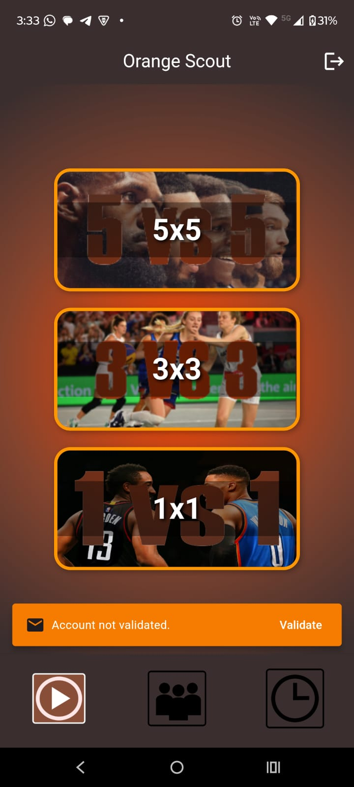

If the user has validated their email but doesn't have at least two teams yet, a snackbar will also be displayed to inform them:

If the user has at least two teams and their email is validated, they'll be redirected to the team and starting player selection screen for each team. Players are displayed in the order they were created:

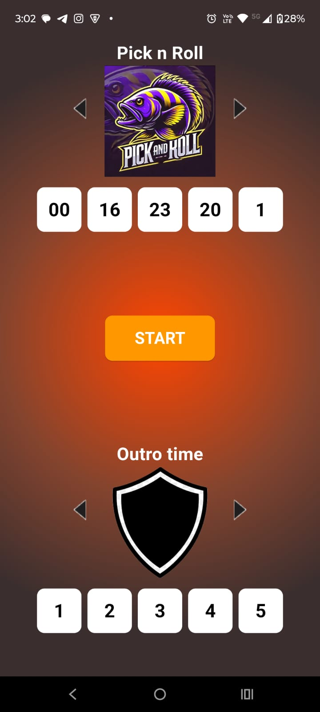

If there aren't enough players on any of the teams for the selected game mode, the "Start Match" button will be disabled:

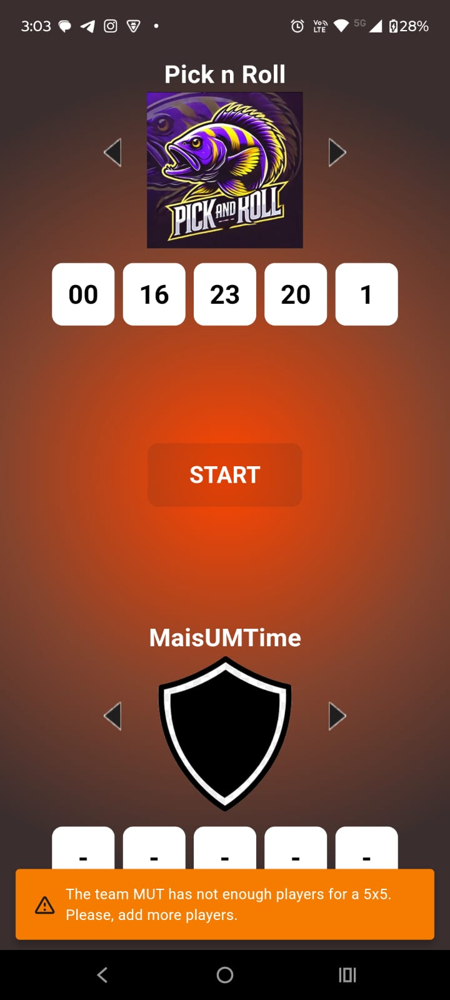

If both teams have enough players, the "START" button becomes enabled. Once pressed, the user is redirected to the stat tracking screen, where they can record player statistics:

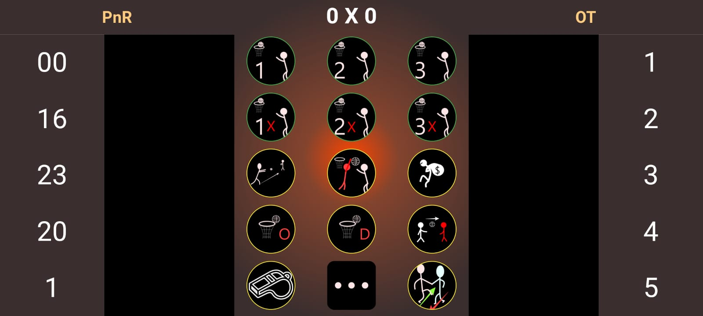

After some actions are recorded, the screen will look like this:

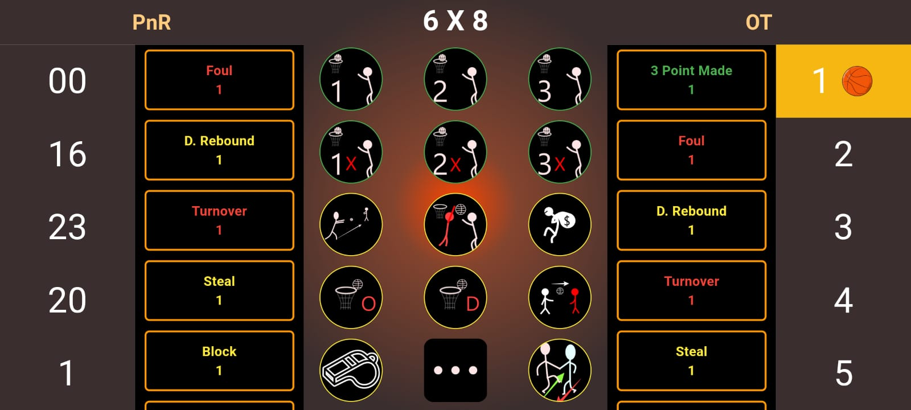

On this screen, in addition to the general action buttons (points, errors, fouls, etc.), there's an options button. When pressed, it expands into a menu with three options:

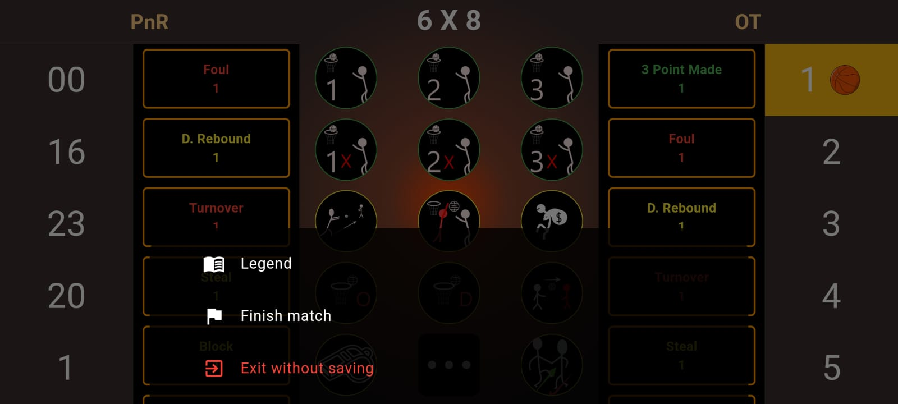

The menu contains the following options:

* **Show Legends** — Displays an image explaining the meaning of each button.
* **Exit Without Saving** — Prompts the user to confirm exiting the game without saving progress.
* **Finish Match** — Saves the match and its statistics to the database.

If the user selects "Show Legends," an image with the legends will appear:

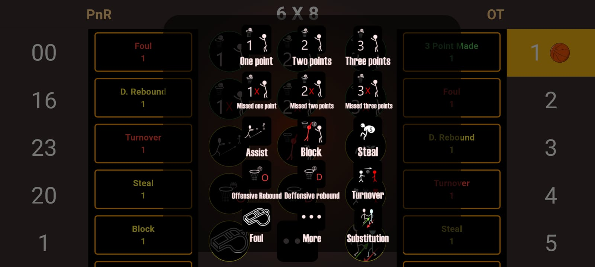

If the user selects "Exit Without Saving," a confirmation prompt will be displayed:

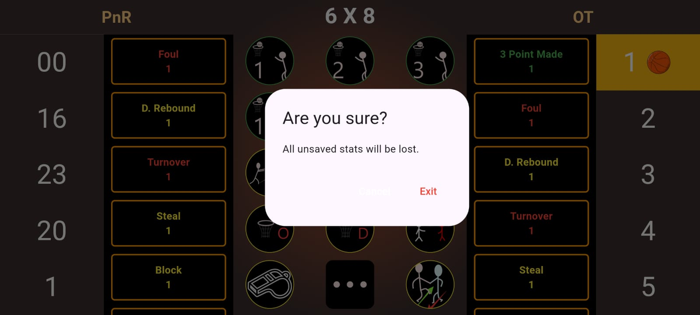

If the user selects "Finish Match," the statistics are saved and sent to the backend, which stores them in the database:

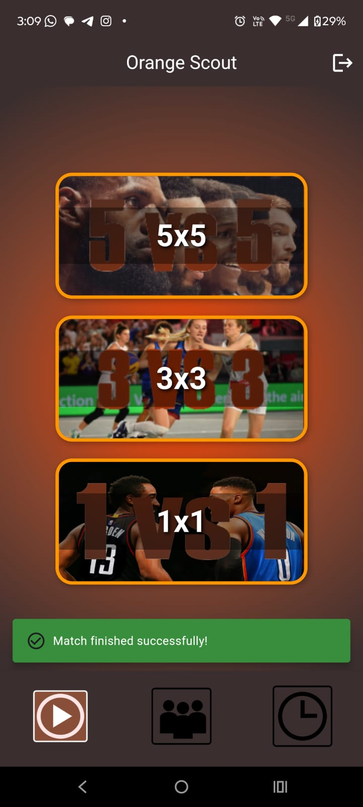

It's possible that during a match, the user minimizes the app to use other applications, and the operating system might terminate the application, causing the user to lose their match progress. To prevent this, a feature was implemented that automatically saves the match whenever the app is minimized. Then, when the user returns to the app, the system checks the database for any unfinished matches. If one is found, the user can choose to continue the match without losing progress:

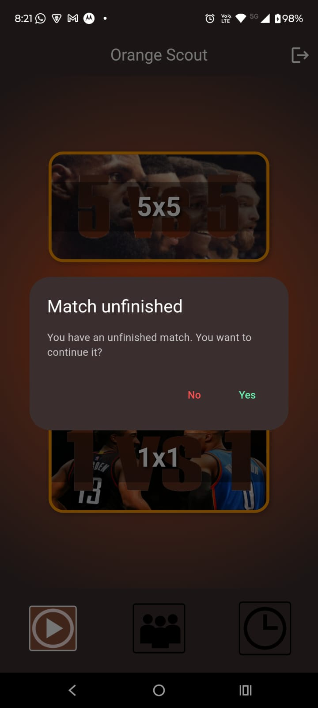

If the user selects "No" (in the unfinished match dialog), the match is finished and saved in the database—it's not discarded. If the user chooses "Yes," they are redirected back to the stat tracking screen and can resume the match.

### Creating and Editing Teams and Players

In the app's navigation bar, the middle button takes the user to the Teams screen. Here, users can view, create, and edit their teams. Another way to access this screen is if the user tries to select a game mode but has fewer than two teams; in that case, clicking on the snackbar will redirect them to the Teams screen:

This brings us to the Teams screen:

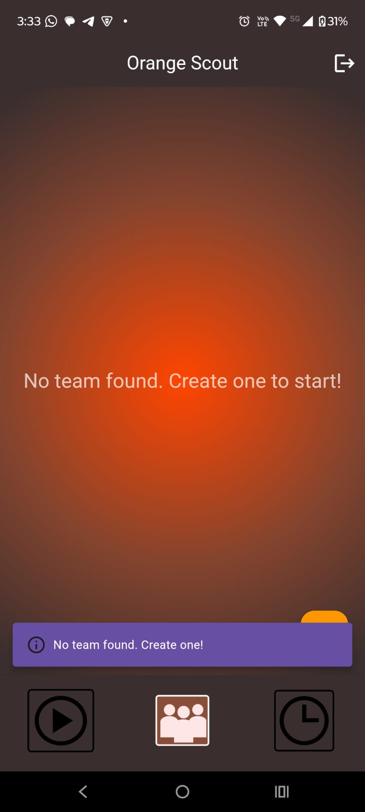

Since the screen is empty, a snackbar appears, prompting the user to create a new team. By clicking the "+" button located in the bottom-right corner, the user is taken to the team creation screen:

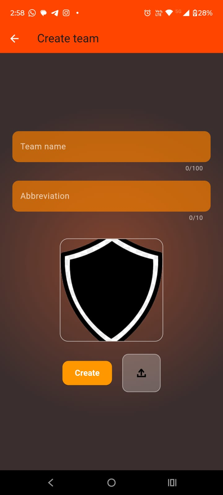

On this screen, there are two input fields, a button to finalize team creation, and a button that opens the device's gallery to select a custom logo for the team. The app will request user permission before accessing storage.

After clicking the "Create" button, the user is redirected back to the Teams screen, which now displays the newly created team:

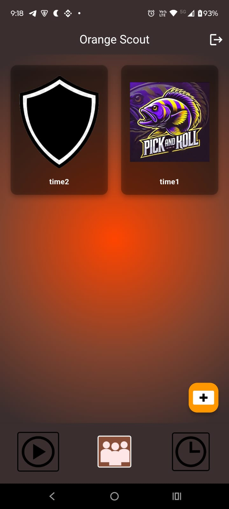

On this screen, clicking on a team allows the user to edit it, displaying options to edit the team, delete it, and manage players:

On the team edit screen, the following options are available:

* **Edit Team**: Represented by the pencil icon in the top-right corner.
* **Delete Team**: Represented by the trash can icon next to the pencil (this includes all associated players).

If the user selects the trash can icon, a confirmation prompt will appear to prevent accidental deletions:

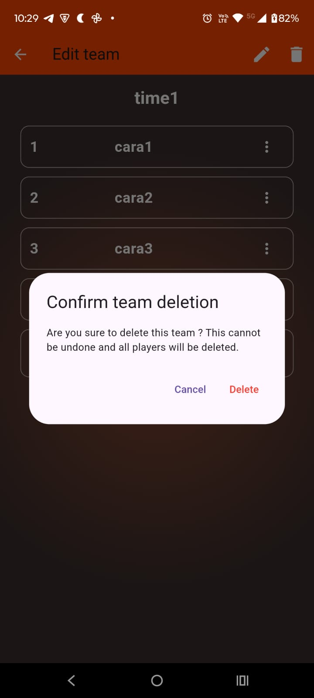

Upon confirming "Delete," the user will be redirected back to the Teams screen, which no longer contains the deleted team.

Still on the Team Edit screen, clicking the pencil icon redirects the user to the Edit Team screen, where they can update the team's name, abbreviation, and logo:

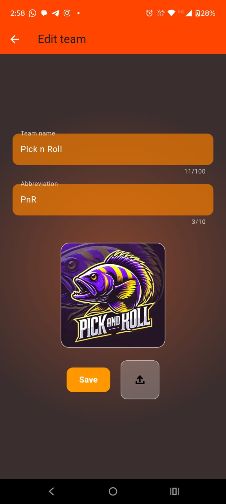

This screen is the same as the Create Team screen, but instead of creating a new team, it updates the selected team.

Additionally, on the Team Edit screen, the user can view the list of players for that team. There is always a dedicated widget for adding a new player.

Next to each player, there's a menu button that, when pressed, opens a menu with options to edit or delete the player:

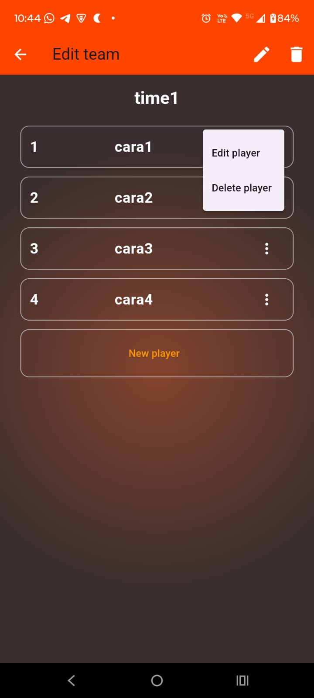

When the menu is open, the user sees the options: "Edit player" and "Delete player."

Selecting "Edit player" opens a dialog with two input fields for editing the player and two buttons: "Save" and "Cancel."

Clicking "Save" updates the player with the new values:

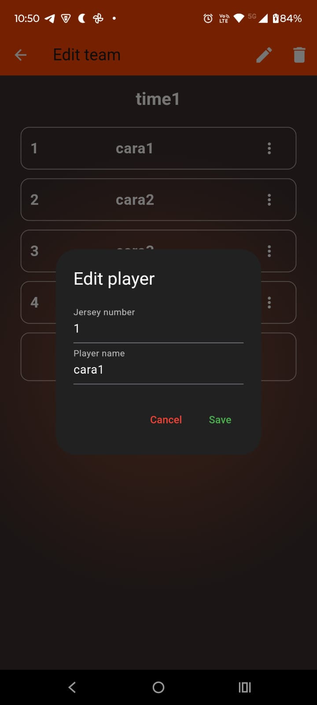

Selecting "Delete player" opens a confirmation dialog to prevent accidental deletions:

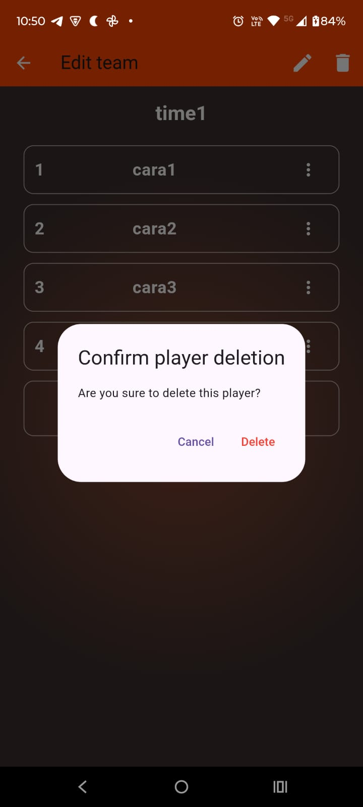

If the user presses "Delete," they are returned to the Team Edit screen, now with the player removed. Pressing "Cancel" simply closes the confirmation dialog without deleting anything.

### Opening the Stats

On the navigation bar, the icon on the far right directs the user to the match history screen:

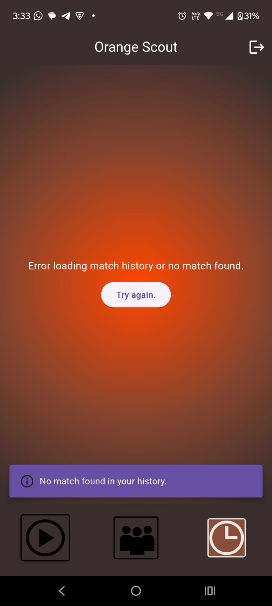

If there are no finished matches, this will be the screen displayed. However, if there are any finished matches, the screen will show match summaries in a list of widgets.

Each match widget contains:

* A button on the far left to open the detailed statistics of that specific match.
* The logo and abbreviation of each team.
* The score and the date of the match.
* A location button to view where the match was played.
* A delete button to remove the match from history.

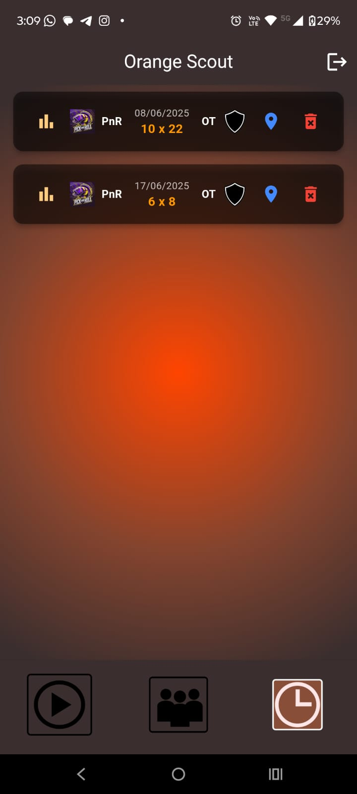

Clicking the red delete button brings up a confirmation dialog to prevent accidental deletion:

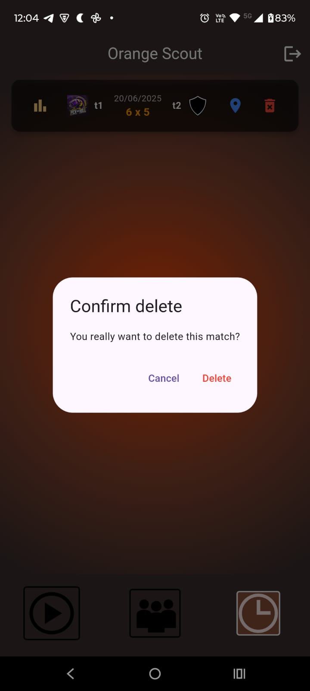

If the user confirms "Delete," they're returned to the history screen, now without the deleted match.

Clicking the statistics button (the icon on the far left of the match widget) opens the Statistics screen for that specific match:

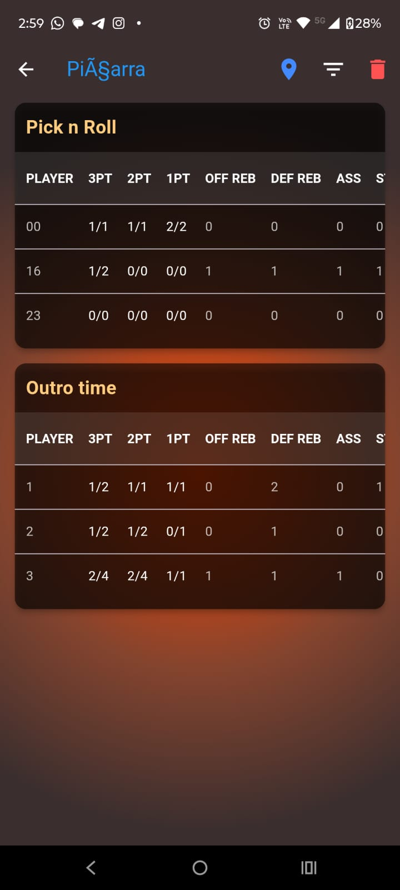

On this Statistics screen, there's also a delete button on the right side in case the user wants to delete the match directly from here:

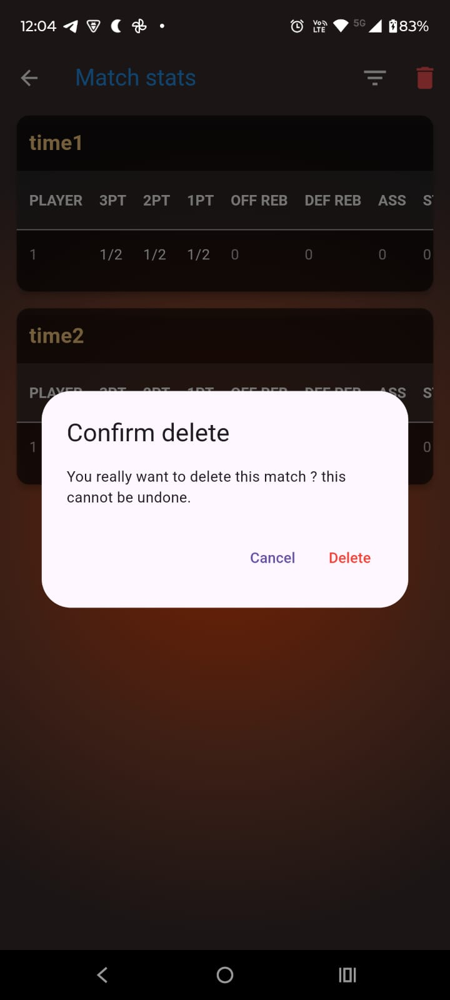

Additionally, this screen includes a filter button that allows the user to filter statistics by team, preventing the screen from becoming too cluttered:

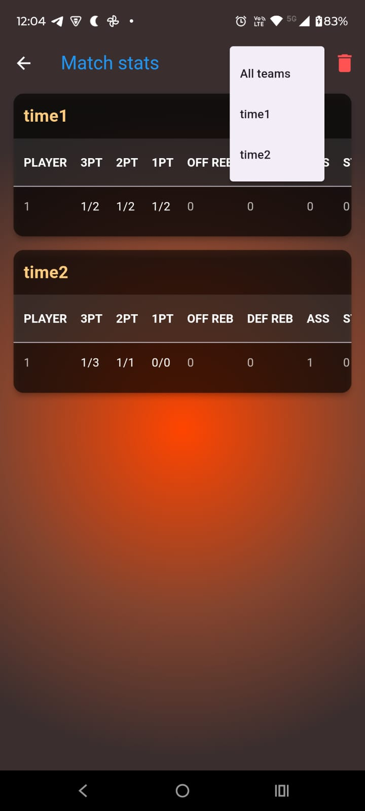

Back on the History screen, there's also a location icon. This button opens the Google Maps app with the coordinates of where the match was played.

The location isn't 100% accurate because the app doesn't use Google's paid APIs for precise location services (for financial reasons). Instead, when a match is finished, the app asks the user for permission to access their location, retrieves the current GPS coordinates, and saves them.

When the location button is clicked, Google Maps opens with those coordinates passed as arguments, showing a random point near where the match actually occurred.

---

## Challenges & Solutions

I encountered many problems during development that I had to address and solve. Some of them include:

* **Database Connection Issues**: I faced `NullPointerException`s with `SqlExceptionHelper` and `UnknownHostException`. Debugging was systematic, involving checking `psql`, the `jdbc:` prefix, environment variables, simplifying passwords, and `sslmode=require`. I spent a lot of time searching for solutions to these issues simply because of incorrect database addresses. The deployment services I used (like Render and others) provided various types of addresses for connecting to my cloud database, but none of them worked directly. Eventually, I realized that these services didn't include the "jdbc:" prefix in the URL, and Spring only reads addresses that have this prefix. Second, the provided URLs weren't in the correct standard format (`jdbc:<host>:<port>`). So, I had to read the addresses provided by the service and combine them with the standard format to make it work, as ultimately, the service gave me the wrong hostname in their provided address, but the full address contained the correct hostname.

* **Deployment Hurdles**: Before deploying, I researched available free options, as I had no budget (and had never deployed anything before, so I assumed there were many good free options). However, upon exploring the free deployment options, I ultimately decided not to make the application publicly available, as the free deployment options didn't provide the necessary resources for a minimally acceptable user experience. Nevertheless, I performed a free deployment for my own testing, choosing Render after watching a video that demonstrated the simplicity of setting everything up there—both the database and API deployment—and also explained how to create the Dockerfile for deployment.

* **Frontend/Backend Alignment (Flutter/Spring Boot)**: During the testing phase, I had to deal with many issues related to type differences between what the backend sent in DTOs and what the frontend received and used to store those responses, and vice versa. Before finalizing development, I had to refactor all the code (with the help of artificial intelligence for productivity), resulting in much better organized code. I also faced debugging difficulties initially because I hadn't included descriptive error messages, which forced me to chase errors by adding `print` statements to the code.

## Learnings

This project was not only for learning but also for financial gain. However, as mentioned, the financial viability did not materialize. Despite this, I believe this project was a turning point for me and my academic and professional development, as I had never followed the development of an application from start to finish.

I gained practical experience in various areas:

* **Problem Solving**: I learned to solve problems independently, regardless of their nature. Before this project, I only knew pure Java (which I learned before my course), Flutter (during the course), and PostgreSQL (during the course). I had no knowledge of APIs, as I hadn't reached that part of the course, nor of Spring Boot and how it simplifies everything.
* **Good Code Practices**: The documentation, which I learned in the course, hadn't been fully internalized due to a lack of practical application, but now it has. Developing a project from start to finish immensely expanded my vision on problem-solving, as I now understand what each team (frontend, backend, database, documentation, requirements analysis) needs to solve a problem.
* **Requirements Analysis**: I learned about the importance of good requirements analysis and how to translate that analysis into development, defining the project scope in the best way to avoid inventing unnecessary features during the process.
* **Security and Environment**: I learned the importance of having documented data standards (database, API, frontend) to reduce errors related to variable types and names. I understood the importance of API documentation for the frontend. I learned to separate methods into files (something I already did on the backend but not immediately on the frontend). I grasped the importance of hiding sensitive credentials (like database URLs, passwords, etc.) in `.env` files and not pushing them to GitHub via `.gitignore`. And finally, the importance of environment variables (not just their existence on the computer, but how to use them with placeholders in the code), how to configure them on the deployment site, and the obvious fact, which I only knew in theory, that the cloud is basically other people's and companies' computers in various parts of the world, which requires a Dockerfile to install what is needed on their machines to run the application.

This project, then, serves as a token of my learning. In the future, I intend to revisit it to improve it and eventually make it publicly available.

## 6. Future Enhancements

During development, I researched and, to my surprise, found that there were already applications with the same goal, but far more advanced and long-established in the market—something I hadn't discovered in my initial research. For this application to stand out against its competitors, it would need a significant differentiator. I already have an idea for this differentiator, but I don't possess the necessary skills to implement it at the moment. I plan to acquire these skills eventually, but I won't be focusing on the application for now.