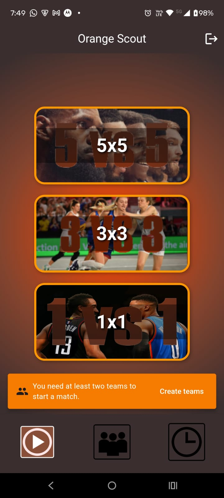

# Orange Scout

## Visão Geral / Overview
**Orange Scout** é um aplicativo mobile para registrar estatísticas de jogadores de forma facil e rapida.

*(English)* 
**Orange Scout** is a mobile app to register player stats in a easy and fast way.

- ### Problema resolvido / Problem solved:  
**Orange Scout** tem como objetivo dar ao usuario o poder de registrar as estatísticas de jogadores durante a partida de basquete, dando a oportunidade de serem visualizadas após o jogo.
Isso permite aos treinadores monitorarem o desempenho dos jogadores durante essa partida para que seus pontos fortes e fracos sejam destacados e, assim, o jogador possa tomar medidas em relação a isso.
  *(English)* 
**Orange Scout** aims to give users the power to record player statistics during a basketball game, and then view them after the game.
This allows coaches to monitor players' performance during the game so that their strengths and weaknesses are highlighted and players can take action on them.

- ### Publico alvo / Target audience:  
Jogadores de basquete, Treinadores de basquete, espectadores de basquete e organizadores de campeonatos.
  *(English)*  
Basketball players, Basketball coaches, Basketball viewers and Tournament organizers.

- ### Características principais / Key features:  
Autenticação do usuario, gerenciamento de times e jogadores, monitoramento de estatísticas em tempo real, historico de partidas e visualização de estatísticas.
  *(English)*  
User authentication, team/player management, real-time stat tracking, match history, and stat visualization.

## Fluxo do usuario e diagramas / User Flow & Diagrams

- #### Autenticação / Autentication  
Ao abrir a aplicação, o sistema checa se o usuario tem um token válido no sistema (ou seja, se um login válido foi feito a pouco tempo). Se o usuário não tiver um token válido, ele será direcionado para a tela de login:

*(English)* 
When opening the application, the system checks whether the user has a valid token (i.e., if a valid login was recently performed). If the user does not have a valid token, they will be redirected to the login screen:

 
Na tela de login temos o formulário para login, o botão para o login e um botão para caso o usuário não tenha conta. Caso o usuário ja tenha conta, ele pode inserir ela nos campos dessa tela e pressionar o botão "Login", sendo direcionado assim para a tela inicial.
Caso o usuário clique no botão "I don't have an account", ele será direcionado para a tela de cadastro: 
 
*(English)* 
On the login screen, there is a form to enter credentials, a button to log in, and a button for users who do not have an account. If the user already has an account, they can fill in their credentials and press the "Login" button to be redirected to the home screen.
If the user clicks "I don't have an account", they will be redirected to the registration screen:
 
Aqui, o usuario poderá voltar à tela de login clicando em "I Already have an account". Caso o usuário preencha os formulários da forma certa e pressionar o botão Register, será mandado um email para o email que foi passado no formulário para a validação e o usuário será direcionado para a tela de validação:

 
*(English)* 
On this screen, the user can go back to the login screen by clicking "I already have an account". If the user fills in the form correctly and presses the "Register" button, an email will be sent to the provided email address containing a validation code. The user will then be redirected to the validation screen:

Nessa tela, o usuário pode fazer o seguinte:
Clicar em voltar e validar depois (durante a tentativa de iniciar a partida), digitar o código que le foi mandado no campo e clicar no botão "Validate", ou clicar em Resend Code, fazendo assim um novo código ser mandado para o email. Caso seja pressionado o Resend Code, um snackBar surgirá indicando que foi mandado o código:

*(English)* 
On this screen, the user has three options:

Click "Back" and validate later (the app will request validation when trying to start a match).

Enter the code received via email in the input field and press "Validate".

Click "Resend Code", which will send a new code to the registered email.

When "Resend Code" is pressed, a snackbar will appear indicating that a new code has been sent:
*Na imagem, a tela de validação pós resend. A barra verde está cobrindo meu email por questões de segurança, mas na prática é mostrado o email.* 

*(English)* 
*In the image, the green bar covers my email for privacy reasons. In the app, the email is displayed correctly.* 

Caso o código correto seja inserido e o botão de Validate for pressionado, o usuário será levado a tela inicial do aplicativo e sua conta estará validada.
 

*(English)* 
If the correct code is entered and the "Validate" button is pressed, the user will be redirected to the app's home screen, and their account will be successfully validated.

- #### Começando uma partida / Starting a match 
Ao ser redirecionado para a tela inicial, o usuario estará na tela de seleção de jogo, onde terá três opções para escolher:

*(English)* 
Upon being redirected to the home screen, the user will be on the game selection screen, where there are three available game modes to choose from:
 
Se o usuário não validou seu email, ele não poderá selecionar nenhum modo de jogo, então uma snackBar aparecerá e ele poderá ir para a tela de validação a partir dai:

*(English)* 
If the user has not validated their email, they won’t be able to select any game mode. A snackbar will appear indicating this, and the user can navigate to the validation screen from there:

Se o usuário tiver validado seu email mas não tiver pelo menos dois times ainda, uma snackBar também aparecerá:

*(English)* 
If the user has validated their email but does not have at least two teams, a snackbar will also be displayed to inform them:

Caso tenha pelo menos dois times e também tiver com o email validado, o usuário será redirecionado para a tela de selecionar os times e jogadores iniciais de cada time. Os jogadores são selecionados de acordo com a ordem de criação.

*(English)* 
If the user has at least two teams and the email is validated, they will be redirected to the team and player selection screen. Players are displayed in the order they were created:
[Tela de seleção de times e jogadores](./assets/tela_game_start_5x5_enough_players.jpeg) 
Caso não existam jogadores o suficientes em algum dos times para o modo de jogo selecionado, o botão de começar a partida é desativado:

*(English)* 
If there are not enough players on any of the teams for the selected game mode, the Start Match button will be disabled:
[Tela de seleção de times e jogadores sem jogadores o suficiente](./assets/tela_game_start_5x5_not_enough_players.jpeg) 
Caso haja jogadores o suficiente em ambos os times, o botão START é habilitado, e pressionando ele, o usuário será redirecionado para a tela de registro de estatísticas, podendo registrar as estatísticas dos jogadores:

*(English)* 
If there are enough players on both teams, the Start button becomes enabled. Once pressed, the user is redirected to the stat tracking screen, where they can record the statistics of the players:
[Tela de jogo sem nada](./assets/tela_game_vazia.jpeg) 
Após algumas ações serem feitas, a tela será algo assim:

*(English)* 
After some actions are performed, the game screen will look like this:
[Tela de jogo com stats](./assets/tela_game_com_stats.jpeg) 
Nessa tela, temos, além dos botões de ações gerais (pontos, erros, faltas...) temos um botão de opções, que caso pressionado, se expandirá um menu com três opções:

*(English)* 
On this screen, besides the general action buttons (points, errors, fouls, etc.), there is an options button, which when pressed expands into a menu with three options:
[Tela de opções](./assets/tela_game_options.jpeg) 
Nesse menu, temos botões para mostrar as legendas dos botões, um botão para sair sem salvar e um botão para finalizar a partida (e salvar). Caso o usuário pressione no botão de legendas, as legendas abrem numa imagem:

*(English)* 
The menu contains the following options:

Show Legends — Displays an image explaining the meaning of each button.

Exit Without Saving — Prompts the user to confirm exiting the game without saving.

Finish Match — Saves the match and its statistics to the backend database.

If the user selects Show Legends, an image with the legends will appear:
[Tela de opções - legendas](./assets/tela_game_legends.jpeg) 
Caso pressione no botão de sair sem salvar, um prompt aparece para confirmar a saída:

*(English)* 
If the user selects Exit Without Saving, a confirmation prompt will be displayed:
[Tela de opções - sair sem salvar](./assets/tela_game_exit_without_saving.jpeg) 
E caso pressione o botão de finalizar partida, as estatísticas são salvas e enviadas para o backEnd, que armazenará no banco de dados:

*(English)* 
If the user selects Finish Match, the statistics are saved and sent to the backend, which stores them in the database:
[Tela de opções - finalizar partida](./assets/tela_inicial_pos_finish_match.jpeg) 
Pode acontecer do usuario, no meio da partida, minimizar o aplicativo para usar outros enquanto isso, e no meio tempo, o sistema operacional destruir a aplicação e o usuário perderá o progresso de sua partida. Para evitar isso, implementei uma funcionalidade que salva sempre que o aplicativo é minimizado e, no momento em que o usuario voltar para o aplicativo, o aplicativo checa no banco de dados se existe uma partida não finalizada, e nesse caso, haverá uma, e o usuário pode continuar sua partida sem perder o progresso:

*(English)* 
It is possible that during a match, the user minimizes the app to use other apps, and during this time, the operating system may terminate the application, causing the user to lose their match progress.
To avoid this, a functionality was implemented that automatically saves the match whenever the app is minimized. Then, when the user returns to the app, the system checks the database for any unfinished match. If one is found, the user can choose to continue the match without losing progress:
[Tela inicial com partida não finalizada](./assets/tela_inicial_unfinished_match.jpeg) 
Caso o usuário selecione que não quer continuar a partida, ela é finalizada e salva no banco de dados, e não descartada. Caso selecione que quer continuar, ele é levado de volta à tela de registro de estatísticas e poderá continuar sua partida.

*(English)* 
If the user selects "No", the match is finished and saved in the database — it is not discarded. If the user chooses "Yes", they are redirected back to the stat tracking screen and can proceed with the match.

- #### Criando e editando um time e jogadores / Creating and editing a team and players 

Na barra de navegação do aplicativo, o botão do meio leva o usuário para a tela de times. Lá, ele poderá visualizar, criar e editar seus times. Outra forma de ir para essa tela é através de, caso o usuário não tenha pelo menos dois times na hora de selecionar o modo de jogo, clicando na snackbar:

*(English)* 
In the app's navigation bar, the middle button takes the user to the Teams screen. On this screen, the user can view, create, and edit their teams. Another way to access this screen is when the user tries to select a game mode but has fewer than two teams. In that case, clicking on the snackbar will redirect them to the Teams screen:

[Tela inicial sem times suficientes](./assets/tela_game_start_5x5_not_enough_teams.jpeg) 
Assim, estamos na tela de times:

*(English)* 
This brings us to the Teams screen:
[Tela de times vazia](./assets/tela_teams_vazia.jpeg) 
Como ela está vazia, uma snackbar aparece pedindo para o usuário criar um novo time. Clicando então no botão "+" localizado no canto inferior direito da tela, ele é direcionado para a tela de criação de time:

*(English)* 
Since the screen is empty, a snackbar appears prompting the user to create a new team. By clicking the "+" button located in the bottom-right corner, the user is taken to the team creation screen:
[Tela criação de time](./assets/tela_teams_create.jpeg) 
Nessa tela, temos dois campos para preencher, um botão de finalizar a criação do time e um botão para navegar entre as fotos do dispositivo para escolher um escudo melhor para o time. O aplicativo vai pedir autorização do usuário antes de qualquer coisa.
Ao clicar no botão "create", o usuário é direcionado a tela de times novamente, mas dessa vez com o novo time lá:

*(English)* 
In this screen, there are two input fields, a button to finalize the team creation, and a button that opens the device’s gallery to select a custom logo for the team. The app will ask the user for permission before accessing storage.

After clicking the "Create" button, the user is redirected back to the Teams screen, which now displays the newly created team:
[Tela de times](./assets/tela_teams_com_times.jpeg) 
Nessa tela, podemos clicar no time para entrar na edição dele, mostrando os botões de edição de time, exclusão e criação de jogadores:

*(English)* 
On this screen, clicking on a team opens the Team Edit screen, where the user can:

Edit the team;

Delete the team;

Create and manage players for the team

[Tela de edição de time](./assets/tela_teams_edit.jpeg) 
Nessa tela temos as seguintes opções:
Editar time, representado pelo lapis no canto superior direito;
Excluir time e todos os jogadores nele, representado pela lixeira do lado do lapis.
Ao selecionar a lixeira, um prompt de confirmação aparecerá para impedir que o usuário exclua o time por acidente:

*(English)* 
On this screen, the following options are available:

Edit Team, represented by the pencil icon in the top-right corner.

Delete Team (including all players in it), represented by the trash can icon next to the pencil.

If the user selects the trash can icon, a confirmation prompt will appear to prevent accidental deletions:
[Tela de exclusão de time](./assets/tela_team_delete.jpeg) 
Ao selecionar o Delete, o usuário será direcionado novamente à tela de times, que estará sem o time recentemente excluído.
Ainda na tela de edição de time, ao selecionar o lápis, o usuário será direcionado para a tela onde poderá editar o nome, abreviação e o escudo do time:

*(English)* 
Upon confirming "Delete", the user will be redirected back to the Teams screen, which no longer contains the deleted team.

Still on the Team Edit screen, clicking the pencil icon will redirect the user to the Edit Team screen, where they can update the team’s name, abbreviation, and logo:
[Tela de edição de time - 2](./assets/tela_create_or_edit_team.jpeg) 
Essa tela é a mesma da tela de criação de time, com a diferença que ela vai atualizar o time ao invés de criar um novo.
Agora, na tela de edição de time também teremos a visualização dos jogadores do time e um dos widgets é reservado para a criação de um novo jogador.
Do lado de cada jogador, temos um botão para abrir as opções do jogador. Ao pressionar esse botão, um menu é aberto com as opções para editar o jogador e para excluí-lo.

*(English)* 
This screen is the same as the Create Team screen, but instead of creating a new team, it updates the selected team.

Additionally, on the Team Edit screen, the user can view the list of players for that team. There is always a dedicated widget for adding a new player.

Next to each player, there is a menu button that, when pressed, opens a menu with the options to edit or delete the player:
[Tela de menu de jogador](./assets/tela_team_player_menu.jpeg) 
Nesse momento, o menu é aberto e temos as opções "Edit player" e "Delete player". Ao pressionar no botão "Edit player", uma janela é aberta com dois campos para a edição do jogador e dois botões, sendo "Save" e "Cancel". Ao pressionar em "Save", o jogador é editado com os valores que estavam nos campos:

*(English)* 
When the menu is open, the user sees the options: "Edit player" and "Delete player".

Selecting "Edit player" opens a dialog with two input fields for editing the player and two buttons: "Save" and "Cancel".

Clicking "Save" updates the player with the new values:
[Tela de edição de jogador](./assets/tela_edit_player.jpeg) 
Já na outra opção a "Delete player", uma janela de prompt de confirmação aparece para que um jogador não seja excluído por acidente.

*(English)* 
Selecting "Delete player" opens a confirmation dialog to prevent accidental deletions:
[Tela de deleção de jogador](./assets/tela_delete_player.jpeg) 
Caso pressione "Delete", o usuário será levado de volta à tela da edição do time, mas agora sem o jogador deletado. O "Cancel" somente tirará a janela de deleção do meio.

*(English)* 
If the user presses "Delete", they are returned to the Team Edit screen, now with the player removed. Pressing "Cancel" simply closes the confirmation dialog without deleting anything.

- #### Abrindo as estatísticas / Opening the stats 

Na navigation bar, o ícone mais a direita direciona o usuário para a tela de estatísticas:

*(English)* 
On the navigation bar, the icon on the far right takes the user to the Statistics (History) screen:
[Tela de historico vazia](./assets/tela_history_vazia.jpeg) 
Se caso não tenha nenhuma partida finalizada, essa será a tela que aparecerá. Mas caso tenha alguma, ao entrar na tela, são mostrados os resumos das estatísticas em uma lista de widgets. 
Cada widget contém:
Um botão para abrir as estatísticas dessa partida em específico mais a esquerda;
O escudo e a abreviação de cada time;
O placar e a data;
Um botão para abrir a localização dessa partida e;
Um botão para excluir a partida.

*(English)* 
If there are no finished matches, this will be the screen displayed. However, if there are any finished matches, the screen will display a list of match summaries, each represented by a widget.

Each match widget contains:

A button on the far left to open the detailed statistics of that specific match.

The logo and abbreviation of each team.

The score and the date of the match.

A location button to view where the match was played.

A delete button to remove the match from the history.
[Tela de historico com partidas](./assets/tela_history_com_exemplos.jpeg) 
Ao clicar no botão vermelho, uma janela de confirmação de deleção aparece para impedir exclusão por acidentes:

*(English)* 
When clicking the red delete button, a confirmation dialog appears to prevent accidental deletion:
[Tela de exclusão de partida](./assets/tela_history_delete_match.jpeg) 
Ao pressionar "Delete", o usuário volta para a tela history, porém dessa vez sem a partida que acabou de ser apagada.
Ao pressionar no botão de abrir estatísticas, no ícone mais a esquerda, é aberta a tela de estatísticas com as estatísticas dessa partida:

*(English)* 
If the user confirms "Delete", they are returned to the history screen, now without the deleted match.

When clicking the statistics button (icon on the far left of the widget), the app opens the Statistics screen for that specific match:
[Tela de estatísticas](./assets/tela_stats.jpeg) 
Nessa tela também tem um botão no lado direito da tela para caso o usuário queira excluir a partida a partir dessa tela:

*(English)* 
On the Statistics screen, there is also a delete button on the right side in case the user wants to delete the match directly from this screen:
[Tela de exclusão em stats](./assets/tela_stats_delete.jpeg) 
Também nessa tela temos um botão para filtrar as estatísticas por time, para impedir a tela de ficar muito lotada:

*(English)* 
Additionally, this screen includes a filter button that allows the user to filter statistics by team, preventing the screen from becoming too cluttered:
[Tela de filtro em stats](./assets/tela_stats_filter.jpeg) 
Voltando à tela history, temos um ícone de localização, que serve para abrir a localização onde a partida foi feita. A localização não está mostrando o local exato por que não usei a API do google por questões financeiras, mas a aplicação primeiro pergunta se pode pegar a localização, depois pega as coordenadas atuais do usuário e salva, isso tudo no momento em que finaliza uma partida. Esse ícone abre o google maps passando as coordenadas como argumento e isso faz com que ele pegueo um local aleatório proximo ao local onde a partida foi feita.

*(English)* 
Back on the History screen, there is also a location icon. This button opens the Google Maps app with the coordinates of where the match was played.

The location isn’t 100% accurate because the app does not use Google’s paid APIs for precise location services (for financial reasons). Instead, when a match is finished, the app asks the user for permission to access their location, retrieves the current GPS coordinates, and saves them.

When the location button is clicked, Google Maps opens with those coordinates passed as arguments, showing a random point close to where the match actually occurred.

